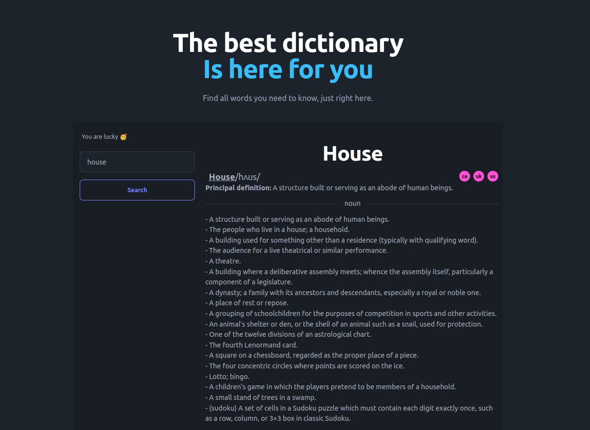

# Dictionary Challenge



## Problem

The goal of this challenge is to create a simple web application that is similar to a dictionary. The user should be able to enter a word and the app must show its meaning.

## Requirements

- You must use the following free access API: https://dictionaryapi.dev/.
- Your GitHub repository must be public.
- We are expecting you to solve it using the technologies you prefer. You just have to be aware that the other participants will review your solution so create it using well accepted technologies everyone could deploy and understand.
- The style of the page is up to you.
- You MUST provide instructions in the README on installing and running your project. We will not infer anything.

## Functionalities

- Search word
- Allow to hear phonetics
- List all the meanings

## Technologies

- React
- Tailwind CSS
- Daisy UI
- Axios
- React Query
- React Router Dom

## Installation

Clone the project repository using the following command:

```Bash
git git@github.com:0riion/dictionary-challenge.git
```

Navigate into the project directory:

```Bash
cd <project-name>
```

Install the required dependencies:

```Bash
npm install
```

Running the Application

```Bash
npm start
```

Open the application in your web browser by visiting http://localhost:3000.
